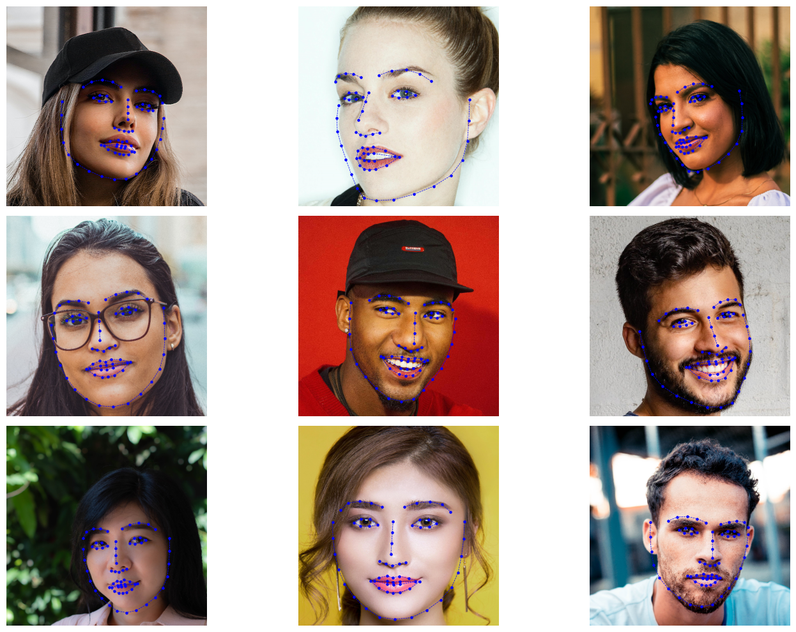
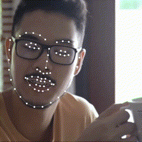

# Facial Key Points Detection

This facial key points detection model (Tensorflow & Keras) takes images of faces as input and attempts to locate a set of 68 key points outlining the facial features. The notebook in this project demonstrates how the model was trained and how the model can be used to make inferences on images and videos.

## Model Performance

### Images

### Videos
 

<!-- 

 -->
## Download Dataset

The Facial Key Point Detection Dataset can be downloaded <a href="https://www.kaggle.com/datasets/prashantarorat/facial-key-point-data">here</a>. 

The downloaded zip file contains an "images" folder and a "all_data.json" file with the annotations. Move these two to the data folder of this project (which is currently empty).
